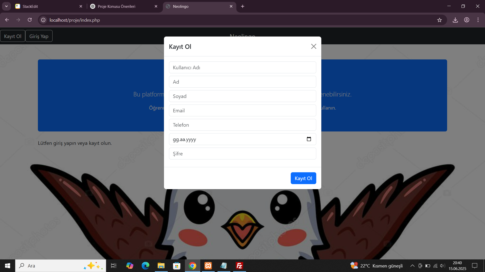

# Neolingo Projesi
Bu proje, Bursa Teknik Üniversitesi Web Tabanlı Programlama BLM-0226 numaralı dersi kapsamınca hazırlanmıştır.

# Proje sahibi bilgileri
Ad:Yusuf
Soyad:Çil
Öğrenci Numarası:22360859012

## Proje Hakkında
Neolingo, kişinin yabancı dil öğrenme becerilerini geliştirmesini sağlamayı amaçlayan bir web sitesidir. Bu site, 5 farklı dil üzerinden kişinin tercih ettiği dil ya da dilleri öğrenmesi için yapılmıştır. Çalıştığınız dil sekmesine öğrendiğiniz kelime ya da kelimeleri kaydedebilir, düzenleyebilirsiniz.  

## Projeyi Deneyimleme
http://95.130.171.20/~st22360859012

## İçerik
Neolingonun içerisinde İspanyolca, İngilizce, Almanca, Fransızca ve Türkçe olmak üzere 5 tane popüler dil bulunmaktadır.

## Kullanılan Teknolojiler
Backend: PHP 8
Frontend: Html5,CSS3, Bootstrap 5
Veritabanı: MySQL
Güvenlik: SQL injection

## Veritabanı Kurulumu

-phpMyAdmin'e giriş yapın.
- Yeni bir veritabanı oluşturun: `dil_ogrenme`
- `veritabani.sql` dosyasını içe aktarın.

## Uygulama İçi Görseller

<h3>Anasayfa</h3>
<table>
  <tr>
    <td></td>
  </tr>
</table>

<h3>Kayıt Ekranı</h3>
<table>
  <tr>
    <td></td>
  </tr>
</table>

<h3>Giriş Ekranı</h3>
<table>
  <tr>
    <td></td>
  </tr>
</table>

<h3>Dil Seçenekleri Menüsü</h3>
<table>
  <tr>
    <td></td>
  </tr>
</table>

## Proje Hakkındaki Youtube Videosu Linki
https://youtu.be/aYpQcWhuRTc

